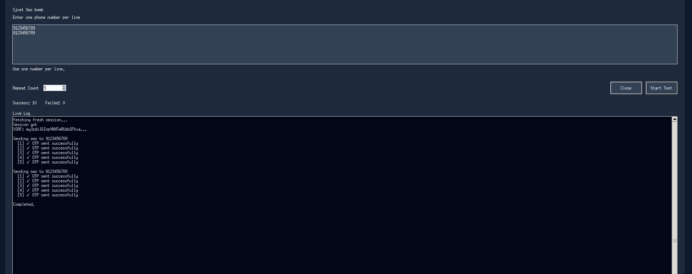

# SJCET SMS BOMBER💀

Enumerates sjcet sms services to send message to anyone we want with bulk sending + repeated sending options..Send sms contains only otp....Use this for fun in your friends circle...

## Demo 



WEBAPP


# How to use
Use webapp with some limitaions
https://sjcet-sms-bomber.abinthomasggllc.workers.dev/
OR
## Requirements

- Python
- Packages [requirements.txt](requirements.txt)


## Setup with uv

Clone the repository and enter its directory:

```bash
git clone https://github.com/abin-karukappallil/SJCET-SMS-BOMBER.git
cd SJCET-SMS-BOMBER
```

Install `uv` if it is not already installed:

```bash
# Linux and macOS
curl -LsSf https://astral.sh/uv/install.sh | sh

# Windows PowerShell
powershell -ExecutionPolicy ByPass -c "irm https://astral.sh/uv/install.ps1 | iex"
```

Create the environment, install dependencies, and run the application:

```bash
uv venv
uv pip install -r requirements.txt
uv run faah.py
```

## Setup with standard Python

Create and activate a virtual environment. On Linux or macOS:

```bash
python3 -m venv .venv
source .venv/bin/activate
python -m pip install -r requirements.txt
python faah.py
```

On Windows Command Prompt:

```bat
py -m venv .venv
.venv\Scripts\activate.bat
python -m pip install -r requirements.txt
python faah.py
```

On Windows PowerShell, activate the environment with:

```powershell
py -m venv .venv
.\.venv\Scripts\Activate.ps1
python -m pip install -r requirements.txt
python faah.py
```
